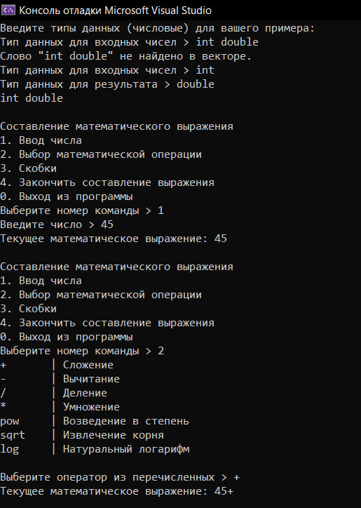
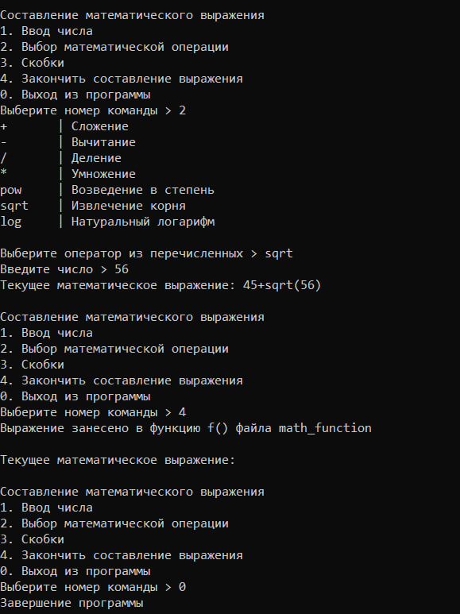

МИНИСТЕРСТВО НАУКИ И ВЫСШЕГО ОБРАЗОВАНИЯ РОССИСКОЙ ФЕДЕРАЦИИ

Федеральное государственное автономное образовательное учреждение высшего образования «Национальный исследовательский университет ИТМО» (НИУ ИТМО)

Факультет программной инженерии и компьютерной техники 


# Отчет по Лабораторной №1 по дисциплине "Программирование на С++"

***Работу выполнила: Люкина Д. С.***

***Группа: P4119***

***Преподаватель: Лаздин А.В.***

--------

***Задача***

Разработать программу, которая вводит с клавиатуры два или три типа данных, и в качестве результата выводит в файл функцию, в которой будут созданы и проинициализированы переменные указанных типов, а также осуществлены арифметические операции над этими переменными с последующим выводом результата.

***Разбор кода***

1. Функция **main** - главная функция, с которой начинается работа программы. В ней вызываются функции для выбора нужного типа данных от пользователя. Создано меню для выбора или создания своего выражения(menuFunction) или просмотра результата работы составленного в прошлый запуск компиляции выражения(функция add_f). 

2. Функция **menuFunction** - пользовательское меню, в котором пользователь выбирает порядок ввода необходимых элементов выражения

3. Функция **choiceTypes** - ввод пользователем типа данных, тип данных должен быть обязательно только числовым, поэтому в этой функции осуществляется также проверка введеннего значения со значениями из вектора, состоящих из названий числовых типов данных

4. Функция **numericalInputValidation** - функция для проверки ввода пользователем числа. Функция перегружена template \<typename T>, где T - тип данных введенного числа. Тип данных пользователь выбирал через функцию choiceTypes

5. Функция **inputNumber** - также функция для ввода пользователем данных, но только идет проверка на соответствие нужному типу данных, который пользователь выбрал ранее

6. Функция **choiceOperation** - функция выполняет чтение необходимых операторов из файла operations.txt, а далее пользователь выбирает из предложенных операторов необходимый и эти операторы потом присоединяются к выражению, составляемого пользователем в рамках данной программы. В случае операторов возведения в степень (pow), извлечения из корня(sqrt) и логарифмирования (log) дополнительно пользователь вводит дополнительно данные, которые будут вычисляться с помощью этих функций. Числа сразу в этом случае вставляются также в результирующее выражение

7. Функция **inputBrackets** - ввод пользователем скобочек закрывающей и открывающей

8. Функция **codeGeneration** - функция генерации содержимого файла math_function.cpp. В нем будет содержать функция add_f(), которая выводит результат вычисления выражения, сформированного в итоге пользователем

***Результаты***




В итоге сформировался файл с функцией с нужным кодом
```rb
#include <iostream>
#include <cmath>
double add_f();
double add_f() {
std::cout << "45+sqrt(56) = " << 45+sqrt(56) << std::endl;
return 0;
}
```

***Недостатки программы:***

1. Не проработаны все варианты ввода данных, нет защиты от дурака при составлении выражения пользователем

2. Результат работы функции add_f() (которая создается в файле math_function во время работы программы) не можем увидеть сразу во время текущей компиляции программы. Для этого программу необходимо скомпилировать заново и выбрать пункт меню "2. Посмотреть результат выражения, составленной при прошлой компиляции программы".
В программе подстроенно так, что файл math_function первоначально существует, поэтому его спокойно можем подключить директивой include, а после составления выражения пользователем файл просто перезаписывается.

***Вывод:***

Реализована программа, позволяющая пользователю создавать свое математическое выражение, используя консольное меню, и итоговое выражение заносить в отдельный файл в виде функции, результат работы которой можно посмотреть при следующей компиляции программы. В итоге реализации были изучены такие основные темы, как ввод/вывод, файловый ввод вывод, основные типы данных и выражения, понятие функции и основы компиляции